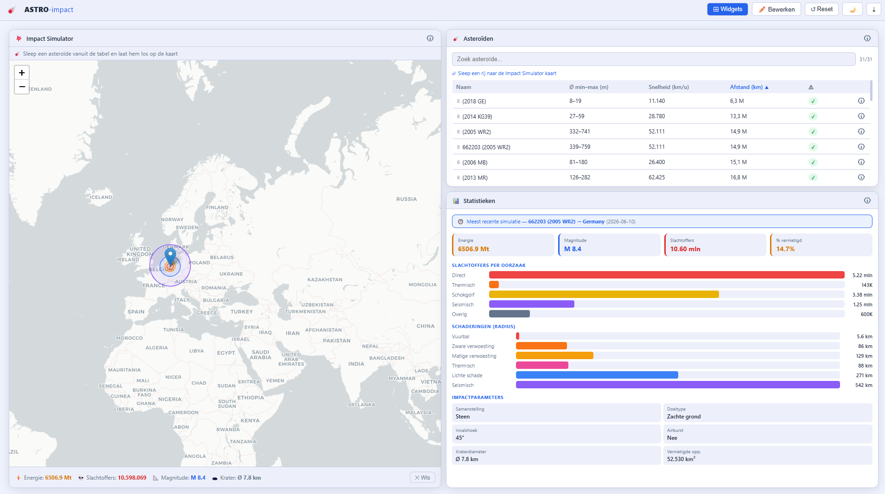

# ASTRO-impact — Interactief Asteroïde Impact Dashboard


Een volledig interactief webdashboard dat realtime NASA-data combineert met een fysisch impactmodel om asteroïde-inslagen te simuleren, visualiseren en analyseren.

> **Refactor-geschiedenis:** het project begon als een Python CLI-applicatie (eindproject NOVI Hogeschool). De backend is sindsdien uitgebreid naar een volledige Flask REST-API en de interface is volledig herbouwd als een React-dashboard.

---

## Schermafbeelding



---

## Architectuur

```
ASTRO-impact-webapp/
├── app.py                    # Flask REST-API (poort 5000)
├── richter_schaal.py         # Richter-schaaldata
├── setup_db.sql              # Database-schema (eenmalig uitvoeren)
├── requirements.txt          # Python-dependencies
└── dashboard/                # React-frontend (Vite, poort 3000)
    └── src/
        ├── App.jsx            # Hoofdlayout — drag & drop grid, widget-toggles
        ├── components/
        │   ├── GlobeModal.jsx        # Three.js 3D globus — vuurbollen & landgrenzen
        │   └── SimulatorModal.jsx    # Compositie/doeltype-keuze-modal
        └── widgets/
            ├── WidgetAsteroids.jsx        # NASA Near-Earth Objects
            ├── WidgetSimulatorMap.jsx     # Interactieve impactkaart
            ├── WidgetStats.jsx            # Simulatiestatistieken + internationale impact
            ├── WidgetNewsArticle.jsx      # AI-gegenereerd nieuwsartikel
            ├── WidgetFireballs.jsx        # NASA fireball-database + 3D globus
            ├── WidgetEarthquakes.jsx      # USGS aardbevingen
            ├── WidgetRandomAsteroid.jsx   # Willekeurige asteroïde
            └── WidgetDbStatus.jsx         # Databaseverbinding
```

### Tech stack

| Laag | Technologie |
|---|---|
| Frontend | React 18, Vite, react-grid-layout, react-leaflet, Three.js, react-markdown |
| Backend | Python 3, Flask, pymysql, Anthropic SDK |
| Database | MariaDB / MySQL 8+ |
| Externe API's | NASA NeoWs, NASA Fireball, USGS Earthquakes, Nominatim, Pollinations.AI |

---

## Installatie

### Vereisten

- Python 3.10+
- Node.js 18+
- MariaDB of MySQL 8+
- Gratis NASA API-sleutel via [api.nasa.gov](https://api.nasa.gov)

### 1 — Clone de repository

```bash
git clone https://github.com/Steffan1988/ASTRO-impact-webapp.git
cd ASTRO-impact-webapp
```

### 2 — Backend instellen

```bash
pip install -r requirements.txt
```

Maak een `.env` bestand aan in de root:

```
API_KEY=jouw_nasa_api_key
ANTHROPIC_API_KEY=           # leeg laten voor demo-modus
```

### 3 — Database instellen

```bash
mysql -u root -p < setup_db.sql
```

Of maak een dedicated gebruiker aan:

```sql
CREATE USER 'astro'@'localhost' IDENTIFIED BY 'jouw_wachtwoord';
GRANT ALL PRIVILEGES ON astro_impact.* TO 'astro'@'localhost';
FLUSH PRIVILEGES;
```

Pas vervolgens `DB_CONFIG` in `app.py` aan naar jouw inloggegevens.

### 4 — Flask-server starten

```bash
python app.py
```

De API is beschikbaar op `http://localhost:5000`.

### 5 — React-frontend starten

```bash
cd dashboard
npm install
npm run dev
```

Open `http://localhost:3000` in de browser.

---

## Dashboard-functionaliteit

Het dashboard bestaat uit een **vrij indeelbaar widget-grid**. Widgets kunnen naar wens worden aan- en uitgezet, verplaatst en vergroot/verkleind. De lay-out wordt automatisch opgeslagen in `localStorage`.

| Knop | Functie |
|---|---|
| **Widgets** | Schakel individuele widgets aan of uit |
| **Bewerken** | Vergrendel of ontgrendel de lay-out voor drag & resize |
| **Reset** | Herstel de standaard lay-out |

---

## Widgets

### Asteroïden

Toont alle Near-Earth Objects van de afgelopen 7 dagen via de **NASA NeoWs API**.

- Kolommen: naam, diameter (min–max in meter), snelheid (km/u), afstand (km), gevaarlijkheidsstatus
- **Alle kolommen zijn sorteerbaar** — klik op een kolomkop om oplopend/aflopend te sorteren; actieve kolom is gemarkeerd met ▲/▼
- Zoekbalk om snel te filteren
- Rijen zijn **draggable naar de Impact Simulator kaart** — sleep een asteroïde op een land om een simulatie te starten

---

### Impact Simulator

Een interactieve wereldkaart (Leaflet, CartoDB-tegels) voor het simuleren van asteroïde-inslagen.

**Werkwijze:**
1. Sleep een rij uit de Asteroïden-widget en laat hem vallen op een locatie op de kaart
2. Nominatim reverse-geocoding detecteert automatisch het land en de dichtstbijzijnde stad
3. Een **animatie-modal** verschijnt met twee keuze-stappen:
   - **Samenstelling:** Steenachtig (🪨), IJzer (⚙️) of Komeet (☄️) — elke optie heeft een eigen CSS-animatie en uitleg over de effecten op de inslag
   - **Doeltype:** Vaste grond (⛰️), Oceaan (🌊) of Zachte bodem (🌿) — beïnvloedt kratersvorming en energieoverdracht
4. Het **Collins et al. (2005) impactmodel** berekent de schade
5. Op de kaart verschijnen **6 gekleurde schade-cirkels** met popup-uitleg:

| Zone | Kleur | Omschrijving |
|---|---|---|
| Vuurbal / Krater | Rood | Totale vaporisatie, kraterzone |
| Zware verwoesting | Oranje | Overpressure > 138 kPa, sterftekans > 90% |
| Matige verwoesting | Geel | Overpressure > 34 kPa, sterftekans ~50% |
| Thermisch | Roze | 3e-graads brandwonden, sterftekans ~40% |
| Lichte schade | Blauw | Glasbreuk, trommelvliesschade |
| Seismisch | Paars | Seismische schokgolf |

6. Een resultatenbalk toont: energie (megaton TNT), slachtoffers, Richter-magnitude en kraterdiameter
7. Simulatieresultaten worden opgeslagen in de database voor gebruik door andere widgets
8. De kaart schaalt automatisch mee bij widget-resize via `ResizeObserver`; uitzoomen past dynamisch een `minZoom` toe zodat er nooit grijze randen zichtbaar zijn

---

### Statistieken

Geeft een uitgebreide analyse van de meest recente of geselecteerde simulatie:

- **Kerngetallen** — energie (Mt TNT), seismische magnitude, **totale wereldwijde slachtoffers** en percentage verwoest landoppervlak
- **Slachtoffers per oorzaak** — balkdiagram voor direct, thermisch, schokgolf, seismisch en overige doden
- **Schaderingen (radius)** — balkdiagram voor alle 6 zones in km
- **Internationale impact** — automatisch berekende lijst van naburige landen die door de schokgolf, thermische straling of seismische golven worden getroffen:
  - Effectieve-afstandsmodel: `eff_dist = max(0, dist − min(√(area/π), dist × 0.5))` om grote landen correct te behandelen
  - Per land: afstand (km), ergste schade-zone, kleurcode en geschatte slachtoffers
  - De **Slachtoffers**-teller bovenin telt automatisch álle wereldwijde slachtoffers op (getroffen land + buurlanden)
- **Impactparameters** — samenstelling, doeltype, invalshoek, airburst, kraterdiameter en vernietigde oppervlakte

---

### AI Nieuwsbericht

Genereert een fictief, cinematisch nieuwsartikel over een geselecteerde simulatie.

- Selecteer een simulatie via de dropdown
- Klik **🔥 Genereer artikel** om te starten
- De tekst wordt **realtime gestreamd** via Server-Sent Events (SSE) met een levend tikeffect
- Na voltooiing wordt het artikel opgeslagen in de database
- Het artikel vermeldt automatisch **naburige landen en specifieke steden** die door de seismische schokgolf zijn getroffen (bijv. *"in steden als Sofia, Belgrade en Budapest werden bruggen gesloten"*)
- Het **totale wereldwijde dodental** (getroffen land + buurlanden) staat prominent in de aanhef
- **Met Anthropic API-sleutel:** Claude schrijft een volledig journalistiek artikel (500–700 woorden) met concrete plaatsnamen, fictieve citaten van wetenschappers en vergelijkingen met historische inslagen
- **Demo-modus (geen sleutel):** lokaal gegenereerd artikel op basis van de simulatiedata, inclusief een speciale extinctievariant voor catastrofale inslagen
- Sfeerimpressie via **Pollinations.AI** (gratis, geen API-sleutel vereist)

---

### Vuurbollen

Recente meteoor-fireball-waarnemingen uit de **NASA Fireball & Bolide database**.

- Top 15 energierijkste gebeurtenissen gesorteerd op vrijgekomen energie
- Toont: datum, energie (kiloton TNT), locatie, hoogte en snelheid
- Klik op 🌍 naast een waarneming om een **interactieve 3D-globus** te openen:
  - Gebouwd met **Three.js** (WebGL) — roterende bol met oceaankleur, groen ingevulde landmassa's (TopoJSON canvas-textuur) en witte landgrenzen (LineSegments)
  - De vuurbollocatie is gemarkeerd met een **drielaagse gloeiende vuurbol**: kern (geel), middenlaag (oranje) en halo (rood) met `AdditiveBlending` voor een pulserende gloed
  - De globus kan worden **gedraaid, gekanteld en ingezoomd** met de muis

---

### Aardbevingen

Recente significante aardbevingen via de **USGS Earthquake Hazards API**.

- Magnitude-slider om een minimumdrempel in te stellen
- **Alle kolommen zijn sorteerbaar** via klikbare kolomkoppen:
  - **M** — magnitude
  - **Locatie** — alfabetisch
  - **Datum** — standaard meest recent bovenaan
  - **Diepte (km)**
- Magnitudes zijn kleurgecodeerd: groen (< 5), oranje (5–7), rood (≥ 7)

---

### Willekeurige Asteroïde

Kiest een willekeurige asteroïde uit de huidige NASA-dataset en toont de details: naam, diameter, snelheid, afstand en gevaarlijkheidsstatus.

---

### Database Status

Toont de verbindingsstatus met de MySQL-database en het aantal opgeslagen simulaties. Handig om de backend-configuratie te controleren.

---

## Fysisch impactmodel

De simulaties zijn gebaseerd op het **Collins, Melosh & Marcus (2005)** impactmodel:

- **Holsapple (1993)** — kraterskalering (transitant → definitief)
- **Glasstone & Dolan (1977)** — luchtgolfdruk en thermische straling
- **Melosh (1989)** — atmosferische intrede en airburst-drempel

Het model berekent:

| Parameter | Beschrijving |
|---|---|
| Kinetische energie | joules en megaton TNT |
| Airburst | detectie + hoogte in km |
| Krater | diameter en diepte in km |
| Seismische magnitude | Richter-schaal |
| 6 schade-zones | radii in km |
| Slachtoffers | per zone op basis van bevolkingsdichtheid |

---

## Database-schema

Twee tabellen:

- **simulations** — alle impactparameters, schadedata en locatiegegevens per simulatie
- **articles** — gegenereerde AI-nieuwsartikelen gekoppeld aan een simulatie (foreign key + CASCADE DELETE)

Initialiseer met:

```bash
mysql -u root -p < setup_db.sql
```

---

## API-endpoints (Flask)

| Endpoint | Methode | Beschrijving |
|---|---|---|
| `/api/asteroids` | GET | Nabije asteroïden (NASA NeoWs, dagelijks gecached) |
| `/api/simulate` | POST | Voer een impactsimulatie uit |
| `/api/simulations` | GET | Lijst van opgeslagen simulaties |
| `/api/simulations/<id>/affected` | GET | Naburige landen getroffen door de inslag (zone + slachtoffers) |
| `/api/article/generate` | POST | Genereer een AI-nieuwsartikel (SSE stream) |
| `/api/article/<sim_id>` | GET | Haal opgeslagen artikel op |
| `/api/nasa/fireballs` | GET | NASA fireball-database |
| `/api/usgs/earthquakes` | GET | USGS significante aardbevingen |
| `/api/countries` | GET | Landendatabase met populatie & coördinaten |
| `/api/random/asteroid` | GET | Willekeurige asteroïde |
| `/api/db/status` | GET | Databaseverbindingsstatus |
| `/api/geocode` | GET | Plaatsnaam-zoekfunctie (Nominatim) |
| `/api/img/<filename>` | GET | Lokaal opgeslagen Pollinations-afbeelding |

---

## Over dit project

ASTRO-impact is begonnen als eindproject binnen de module *Programming Fundamentals* bij **NOVI Hogeschool** — een interactieve Python CLI-simulatie. Het project is sindsdien volledig doorontwikkeld: de backend is omgebouwd naar een Flask REST-API met MySQL-database, en de interface is herschreven als een moderne React-webapplicatie met drag & droppable widgets, een Leaflet-kaart en AI-integratie.
